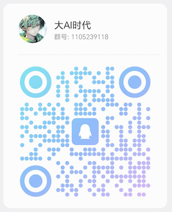

# Open-Part-Skills

EOS. 开放的部分 Skills，可用于 Claude Code、Cursor、CodeX 等工具。

AI交流群：**1105239118**，有新内容更新会在里边通知，也可以提一些建议或者想法

## 安装

```bash
npx skills add https://github.com/gitByEOS/open-part-skills --skill <skill-name>
```

## Skills

[](https://skills.sh/gitByEOS/open-part-skills)


[](https://gitbyeos.github.io/open-part-skills/skill-matrix/dist/) 

| 技能 | 说明 | 版本 | 上次更新 |
|------|------|------|----------|
| [webfetch-plus](./skills/webfetch-plus/SKILL.md) | 使用 Browser 抓取普通 WebFetch 失败的网页，输出适合大模型阅读的正文文本 | 1.0.3 | 2026-05-19 |
| [testcase](./skills/testcase/SKILL.md) | 通过本skill的规则来完善用户测试用例的完整性和有效性 | 1.0.0 | 2026-05-19 |
| [vite-plus](./skills/vite-plus/SKILL.md) | 最新的适合 Agent 开发 Web 前端工具链，一体化开发/构建/测试/发布/格式化 | 1.0.0 | 2026-05-19 |
| [switch-chat](./skills/switch-chat/SKILL.md) | 切换会话交接任务时使用，生成可快速编辑网页，让新会话能无缝继承工作 | 1.0.0 | 2026-05-19 |
| [git-review](./skills/git-review/SKILL.md) | 审查指定范围内 Git 提交，Agent 逐 commit 评估风险，双索引聚合输出可视化安全审查报告 | 1.2.0 | 2026-07-08 |
| [memory-graph](./skills/memory-graph/SKILL.md) | 开发了一套 Agent 外挂记忆，关联历史记忆、沉淀会话记忆、提供 web-ui 查看或管理记忆 | 0.2.1 | 2026-05-29 |
| [blog-narrator](./skills/blog-narrator/SKILL.md) | 把博客 Markdown 导出为逐行披露演示 HTML，支持轻量预览和 Edge TTS 分段配音合并 | 1.1.0 | 2026-07-07 |
| [cc-claude](./skills/cc-claude/SKILL.md) | 让 Claude Code 支持自定义渠道和大模型选择; 已经迁移到 [gitByEOS/Clash](https://github.com/gitByEOS/Clash) | 1.0.0 | 2026-06-01 |
| [html-cut](./skills/html-cut/SKILL.md) | 将网页或本地 HTML 渲染为高清 PNG 截图，支持全页、视口、分辨率与加载等待控制，给 Agent用方便手机查看 | 1.0.0 | 2026-07-19 |
| [port-to-public](./skills/port-to-public/SKILL.md) | 临时通过 Cloudflare Quick Tunnel 将本机 loopback HTTP(S) 服务暴露到公网 | 1.0.0 | 2026-07-20 |
| [tmux-serv](./skills/tmux-serv/SKILL.md) | 用全局脚本管理多项目 tmux 常驻服务，建立统一规范，提高管理效率 | 1.0.0 | 2026-07-23 |
| [skill-linker](./skills/skill-linker/SKILL.md) | 软链[安装/卸载]本地 skill/rule，通过 fzf 支持搜索、多选；用于多项目不同 skill 体系切换，或者不常用技能临时开启 | 1.0.0 | 2026-06-03 |
| [juya](./skills/juya/SKILL.md) | 获取橘鸦Juya每日更新的AI早报内容，生成早茶风格排版的早报 HTML | 1.0.3 | 2026-07-06 |
| [mock-ollama](./skills/mock-ollama/SKILL.md) | 代理 Chat、Anthropic、Responses 三协议，支持 Claude Code、Codex/GPT-5.6、Cursor BYOK | 1.1.0 | 2026-07-22 |
| [holiday-of-12306](./skills/holiday-of-12306/SKILL.md) | 生成全年 12306 节假日抢票日历，又忘记抢票了！使用 Skill 一次性解决掉 | 1.1.0 | 2026-07-06 |
| [voice-clone](./skills/voice-clone/SKILL.md) | 使用 Confucius4-TTS Gradio API 做参考音色克隆和文本转语音 | 1.0.0 | 2026-06-23 |
| [similar-judge](./skills/similar-judge/SKILL.md) | 对比两份文本差异，输出相似度与词级差异 JSON，供 agent 程序化量化产物与目标的文本差距，可以用来循环迭代提示词 | 1.0.0 | 2026-06-28 |
| [skill-publish-verify](./skills/skill-publish-verify/SKILL.md) | 发布前黑盒验证：隔离 venv + 路径，agent 以新用户身份自验任意 skill，产出可用性报告 | 1.1.0 | 2026-07-08 |
| [okr-to-html](./skills/okr-to-html/SKILL.md) | 将 OKR Markdown 生成为可切换 Objective 的单页 HTML 看板 | 1.0.0 | 2026-07-06 |
| [meet-record-html](./skills/meet-record-html/SKILL.md) | 将面试/会谈问题 Markdown 生成为可现场填写总结、可临时追加问题的纪要 HTML | 1.0.0 | 2026-07-07 |
| [weather-search](./skills/weather-search/SKILL.md) | 按地点与活动半径查周边天气与空气质量，输出报告与出门防护建议 | 1.0.0 | 2026-07-09 |
| [esflow](./skills/esflow/SKILL.md) | 教会Agent如何使用esflow，简化学习成本，直接从需求到落地 | 0.1.4 | 2026-07-09 |

## Qbot Skills

为 24 小时待命 QQ 机器人定制的技能组合，方便远程办公。

| 技能 | 说明 | 版本 | 上次更新 |
|------|------|------|----------|
| [fetch-what-say](./skills/fetch-what-say/SKILL.md) | 把网站媒体或本地视频，提取文本内容并生成摘要 | 1.0.0 | 2026-06-20 |
| [lan-chat](./skills/lan-chat/SKILL.md) | 局域网聊天室，支持文件传输，方便把产物发到主力机 | 1.0.0 | 2026-07-21 |
| [md-to-png](./skills/md-to-png/SKILL.md) | 把 Markdown 渲染成 HTML，再调用 html-cut 截图，方便手机查看 | 1.0.0 | 2026-07-21 |
| [voice-to-me](./skills/voice-to-me/SKILL.md) | 将回复合成语音并通过 QQ 格式发送  | 1.0.0 | 2026-07-21 |

## MCPs

| 服务 | 说明 | 发布日期 | 如何使用 |
|------|------|----------|----------|
| [agents-chat-mcp](https://github.com/gitByEOS/agents-chat-mcp) | 把 Agent 接入聊天室，从而实现跨设备、跨项目协作的最小架构 | 2026-06-10 | [文档](https://github.com/gitByEOS/agents-chat-mcp#readme) |
| [lark-chat-mcp](https://github.com/gitByEOS/lark-chat-mcp) | 以飞书做桥，省去繁项操作，让你可以通过手机指挥你的 Claude/Cursor | 2026-06-14 | [文档](https://github.com/gitByEOS/lark-chat-mcp#readme) |


## Tools

| 工具 | 说明 | 在线使用 |
|------|------|----------|
| [工具箱](./tools/) | 全部在线工具 | [工具箱入口](https://gitByEOS.github.io/open-part-skills/) |
| [skill-matrix](./tools/skill-matrix/) | 为 Skill 增加可视化效果 | [Skills 矩阵](https://gitByEOS.github.io/open-part-skills/skill-matrix/dist/) |
| [emoj](./tools/emoj/) | EMOJ 大全：搜索、分类浏览、点击复制 emoji | [emoj大全](https://gitByEOS.github.io/open-part-skills/emoj/) |
| [codicon](./tools/codicon/) | 微软开源常用svg图标 | [codicon](https://gitByEOS.github.io/open-part-skills/codicon/) |
| [pngya](./tools/pngya/) | 浏览器内图片压缩 | [图片压缩](https://gitByEOS.github.io/open-part-skills/pngya/) |
| [videoya](./tools/videoya/) | 浏览器内视频压缩 | [videoya](https://gitByEOS.github.io/open-part-skills/videoya/) |
| [Clash](https://github.com/gitByEOS/Clash) | 个人增强版 Claude Code 启动器，增强Team和跨会话协作等多种功能 | [需要安装](https://github.com/gitByEOS/Clash#readme) |
| [FastRead](https://github.com/gitByEOS/FastRead) | 精选离线文字转语音，微软edge可选 | [需要下载](https://github.com/gitByEOS/FastRead/releases) |
| [VideoCaptor](https://github.com/gitByEOS/VideoCaptor) | 从视频提取GIF，从录屏中截取动图 | [需要下载](https://github.com/gitByEOS/VideoCaptor/releases) |
| [hy-mt-server](https://github.com/gitByEOS/hy-mt-server) | 离线启动腾讯 HY-MT 翻译模型 | [需要部署](https://github.com/gitByEOS/hy-mt-server) |

## 交流 & 赞助

[](docs/Coffee_QRCode.png)    [](docs/QGourp_QRCode.png)    

    

## 许可

MIT
